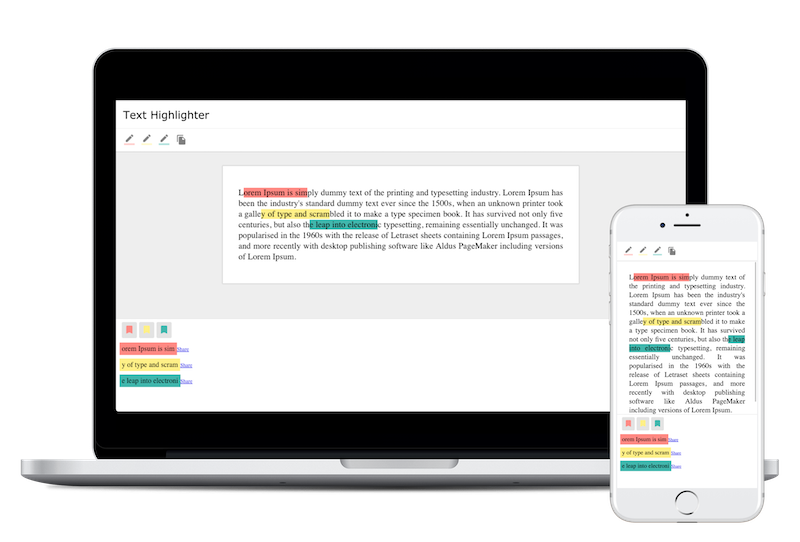

# Text Highlighter




## Running

### Using make

- Install the dependencies: `make setup`
- Run the code: `make run`

### Using yarn

- Install the dependencies: `yarn`
- Run the code: `yarn run`

## Testing

All the tests are under the `__tests__` folder on each component/module. And the e2e tests are under the `e2e` folder.

- Unit tests using make: `make test`
- Unit tests using Yarn: `yarn test`


- E2E tests using make: `make test-e2e`
- Unit tests using Yarn:
  ```bash
    yarn build
    yarn serve&
    yarn test-e2e
  ```


## Directories Structure

When the `component/module` needs more than 1 single file to wrap their logic (and styles) it is wrapped in a folder named as the component name.

Eg: The `<Header />` has some styles and tests. So inside of the folder `components` there is a folder named `Header`.

The `index.js` only serve to import and export as default the Header, to we can import `./components/Header`

*components/Header/index.js*
```js
import Header from './Header'
import './Header.css'

export default Header
```
